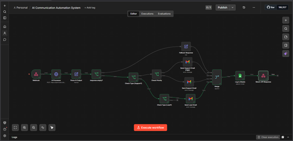
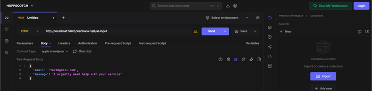
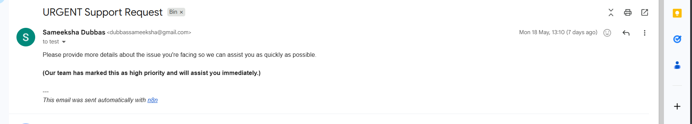
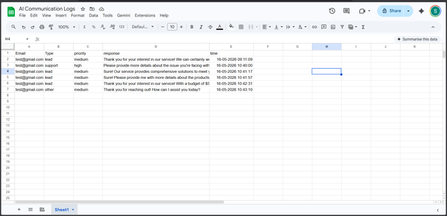
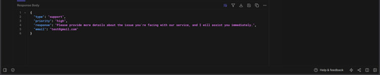

# AI Communication Automation System

An AI-powered communication workflow designed to automate customer interactions by intelligently classifying requests, assigning priority levels, generating responses, and maintaining communication records.

---

## Overview

Handling customer emails, support requests, and inquiries manually can be time-consuming and inconsistent. This project streamlines the communication process by automatically analyzing incoming requests, determining their importance, generating appropriate responses, and logging interactions for tracking and management.

The workflow reduces manual effort, improves response consistency, and helps organizations manage communication more efficiently.

---

## Key Features

- Automated request classification
- Intelligent priority assignment
- Automated response generation
- Communication workflow automation
- Activity logging and tracking
- Faster response handling
- Reduced manual workload
- Scalable communication management

---

## Workflow Design

The workflow follows a structured automation pipeline:

1. Receive incoming request
2. Analyze message content
3. Identify request category
4. Determine priority level
5. Generate appropriate response
6. Send automated notification
7. Record communication activity
8. Deliver final output

### Workflow Architecture

---

## Example Input Processing

Incoming customer requests are automatically captured and processed through the workflow.

---

## Priority Classification

The system evaluates incoming requests and categorizes them based on urgency and importance.

Possible classifications include:

- High Priority
- Medium Priority
- Low Priority

---

## Automated Response Generation

Based on the request type and assigned priority, the workflow generates a structured response automatically.

---

## Communication Logging

Every interaction is recorded to maintain visibility and support future auditing and analysis.

Logged information may include:

- Request category
- Priority level
- Generated response
- Timestamp
- Communication status

---

## Final Output

The workflow produces a structured result that can be integrated with support systems, communication platforms, or business dashboards.

---

## Benefits

### Improved Efficiency

Automates repetitive communication tasks and reduces manual intervention.

### Faster Response Times

Ensures requests are processed and responded to quickly.

### Consistent Communication

Provides standardized responses and handling procedures.

### Better Tracking

Maintains centralized records of communication activities.

### Scalable Operations

Supports growing communication volumes without increasing manual workload.

---

## Technology Stack

- n8n Workflow Automation
- JavaScript
- REST APIs
- Gmail Integration
- Google Sheets Integration
- Webhook-Based Processing

---

## Use Cases

- Customer Support Automation
- Help Desk Operations
- Internal Service Requests
- Product Inquiry Management
- Business Communication Workflows
- Automated Notification Systems

---

## Project Highlights

- Designed an end-to-end communication automation workflow
- Implemented automated request categorization
- Built priority-based response handling
- Automated communication tracking and logging
- Integrated multiple services into a unified workflow
- Reduced manual communication management effort

---

## Future Enhancements

- AI-powered intent detection
- Sentiment analysis integration
- Multi-language support
- CRM integration
- Analytics dashboard
- Advanced reporting features

---

## Author

Developed as an automation engineering project focused on intelligent workflow design, communication automation, and operational efficiency.
